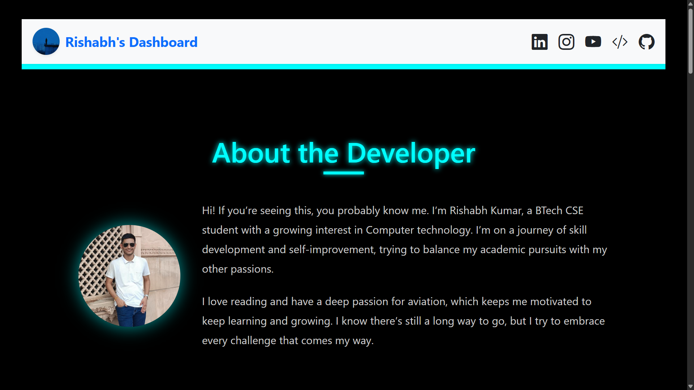
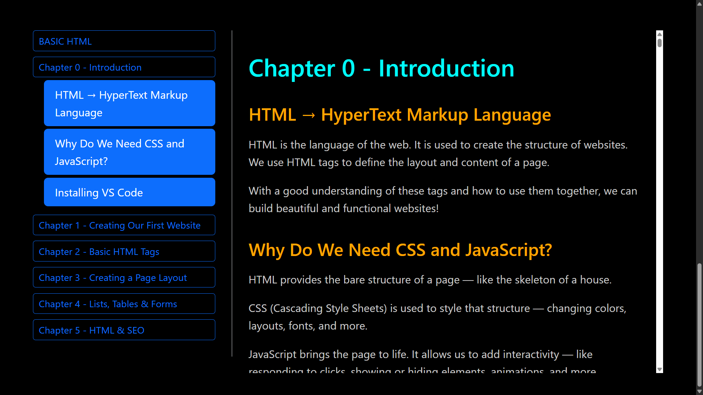
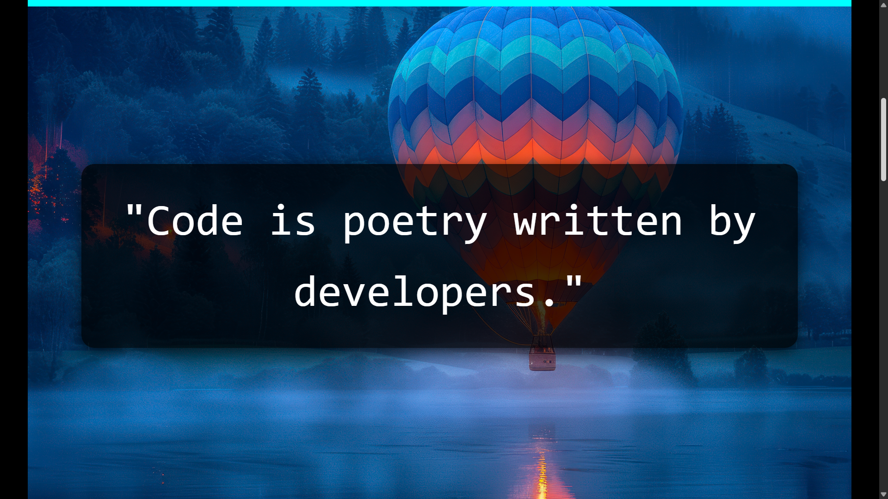

# 🚀 HTML Learning Dashboard

A modern, responsive, and interactive **HTML5 Learning Dashboard** built by **Rishabh Kumar** using **Bootstrap 5**, custom **CSS**, and **scrollspy navigation**. This project is designed to offer an organized and visually engaging way to learn and explore foundational HTML concepts.

---

## 🌐 Live Preview

[🔗 View Live Demo](https://github.com/rishabhkumaar/html)

---

## 📂 Features

- ⚙️ **Responsive Layout**: Mobile-first and adapts beautifully across all devices.
- 📑 **Scrollspy Sidebar**: Navigate easily through different chapters and topics.
- 🖤 **Dark Theme**: Sleek neon-on-dark aesthetic with glowing accent colors.
- 🔍 **On-Page SEO Techniques**: Includes SEO best practices like semantic tags and alt text.
- 📋 **Semantic Structure**: Clean and accessible HTML5.
- 📽️ **Media Embeds**: Includes video embedding, image usage, and form elements.
- 💡 **Developer Intro Section**: Personal “About the Developer” section.
- ✅ **Practice Sets**: Reinforce learning with exercises at the end of each chapter.

---

## 🧠 Chapters Covered

Each chapter is well-organized and scroll-navigable:

- **Chapter 0**: Introduction to HTML and Web Tools
- **Chapter 1**: Creating Your First Website
- **Chapter 2**: Basic HTML Tags
- **Chapter 3**: Page Layouts with Div, Span, Main
- **Chapter 4**: Lists, Tables, Forms, and Multimedia
- **Chapter 5**: SEO and HTML Techniques

---

## 📸 Screenshots

| Main Page | Scrollspy Sidebar | Quote |
|----------|------------------|------------|
|  |  |  |

---

## 🛠️ Tech Stack

- HTML5
- Bootstrap 5
- CSS3 (Custom Styling)
- VS Code (Development Environment)

---

## 🔍 SEO Optimizations

This project uses:

- Semantic HTML tags (`<main>`, `<section>`, `<nav>`, `<article>`)
- Proper heading structure (`h1` → `h6`)
- Descriptive image `alt` attributes
- Metadata and title setup
- Clean URL structure
- Mobile responsiveness
- Accessible color contrast

---

## 🙋‍♂️ About the Developer

I'm **Rishabh Kumar**, a science student passionate about computer science, aviation, and lifelong learning.  
This project is a small but significant step in my journey of skill-building and self-improvement.

---

## 📌 How to Use

1. Clone this repository:
   ```bash
   git clone https://github.com/your-username/html-learning-dashboard.git
   cd html-learning-dashboard

2. Open `index.html` in your browser.

---

## 🔧 Customization Tips

* Want to add your own chapters? Duplicate the format in `index.html` and update the sidebar.
* Want to restyle it? Tweak the `style.css` file.
* Want it light-themed? Replace the dark background with `#fff` and adjust accent colors accordingly.

---

## 📄 License

This project is licensed under the [MIT License](LICENSE).

---

## ⭐️ Credits

Thanks to:

* [Bootstrap](https://getbootstrap.com/)
* [Google Fonts](https://fonts.google.com/)
* [Font Awesome](https://fontawesome.com/) (if used)

---

> “Start where you are. Use what you have. Do what you can.” – Arthur Ashe

---